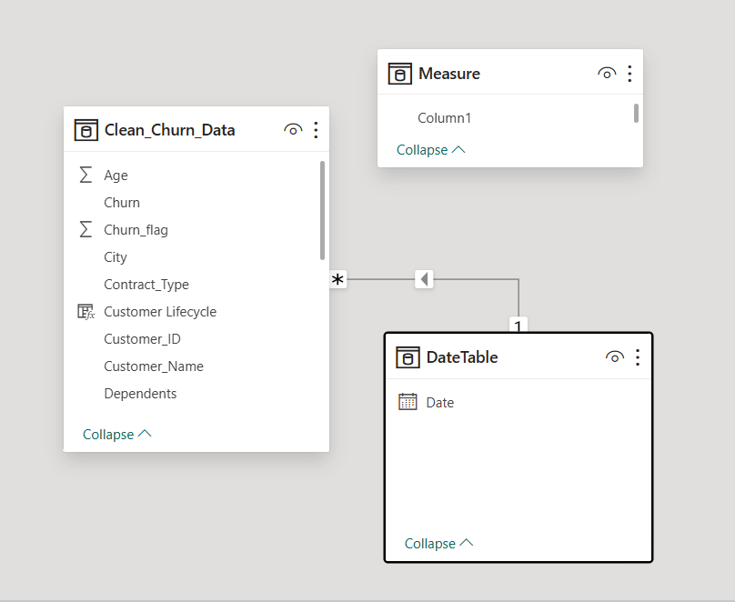

# Churn-and-Retention-analysis
## Project Overview

This project analyzes customer churn, retention patterns, customer value, and revenue risk using Python and Power BI.

## Data Cleaning

The dataset was cleaned and prepared using Python before analysis.

## Power BI Dashboard

### Customer Retention Insights

### Revenue & Customer Value Insights

## Key Insights

- Overall churn rate was 23.62%.
- Developing customers showed relatively high churn.
- Cable customers had the highest observed churn rate among the displayed internet services.
- Established customers represented the largest cumulative customer value.
